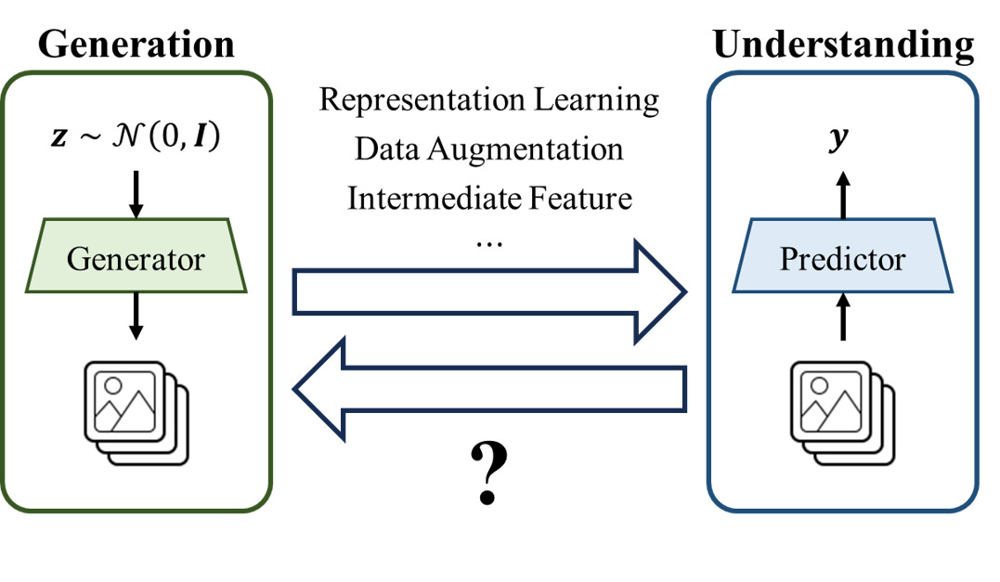

# Vector Quantization

This repository is the official implementation of "[Image Understanding Makes for A Good Tokenizer for Image Generation](https://arxiv.org/abs/2411.04406)".

<!-- TODO: complete lint -->

## Overview

Image understanding (IU) and image generation (IG) have long been central to computer vision research. While many studies explore how IG models can aid IU, few investigate the reverse—**using IU models to enhance IG**.

This work bridges this gap by introducing IU-based tokenizers in the AutoRegressive (AR) IG framework. Specifically, we evaluate the following tokenizers:

- [VQGAN](configs/vqgan/README.md)
- [CVQ-VAE](configs/cvq_vae/README.md)
- [FSQ](configs/fsq/README.md)
- [VQ-KD](configs/vqkd/README.md)
- [Cluster](configs/cluster/README.md)

The VQ-KD and Cluster tokenizers leverage pretrained models such as CLIP, delivering superior results compared to traditional tokenizers. The following sections provice detailed instructions for training and evaluating these tokenizers.

## Preparation

Please follow [data.md](docs/data.md) and [installation.md](docs/installation.md) to prepare the data and environment.

Use [pretrained_models.md](docs/pretrained_models.md) to download the pretrained models.

Generate the FID cache as described in [metrics.md](docs/metrics.md#cache).

## Framework

Please refer to [training.md](docs/training.md) and [validation.md](docs/validation.md) for detailed instructions on training and validating the tokenizers. The model card is available in [model_card.md](docs/model_card.md).

## Acknowledgments

This project draws inspiration from the following works:

- [VQGAN](https://github.com/CompVis/taming-transformers)
- [BEiT v2](https://github.com/microsoft/unilm/tree/master/beit2)
- [CVQ-VAE](https://github.com/lyndonzheng/CVQ-VAE)
- [LlamaGen](https://github.com/FoundationVision/LlamaGen)

For a full list of influential works, please refer to our paper.
